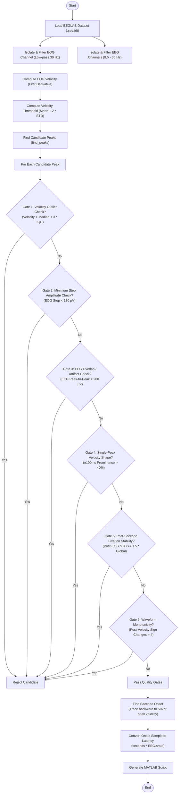

# Saccade Detection Script Documentation

## Overview
The `detect_saccades.py` script automatically detects saccadic eye movements from an EOG channel within an EEG dataset (stored in EEGLAB `.set`/`.fdt` format). It applies velocity thresholding and a series of rigorous quality gates to filter out noise, outputting the detected events into a MATLAB script that can be used to insert the events back into EEGLAB.

## Processing Flow



## Requirements
Ensure you have the required dependencies installed. You can install them using:
```bash
pip install mne numpy scipy
```
*(Or by using `pip install -r src/python/phantom-array-experiment/requirements.txt` if available)*

## Usage
The script is run from the command line and will prompt you for the input and output paths.

### Running the Script
Execute the script using Python:
```bash
python src/python/phantom-array-experiment/detect_saccades.py
```

### Inputs
When prompted, provide the following information:
1. **Data file path**: The path to your input dataset, e.g., `data/80O.set`.
2. **Output path**: The path where you want the output MATLAB script to be saved, e.g., `out/add_saccade_events.m`.

### Output
The script generates a MATLAB `.m` file containing commands to add the detected saccades as events into your loaded `EEG` variable in EEGLAB.

To use the output in MATLAB:
1. Load your `.set` file into EEGLAB.
2. Open the generated MATLAB script in the MATLAB editor.
3. Run the script. It will append the saccade events to `EEG.event` and check for consistency.

---

## Technical Configuration & Parameters

The behavior of the detection pipeline is governed by several customizable thresholds and parameters:

| Parameter / Config | Code Identifier / Context | Default Value | Description |
| :--- | :--- | :--- | :--- |
| **Velocity Threshold Z-Score** | `threshold_z` | `2.0` | Z-score multiplier above the mean absolute velocity to define candidate peaks. |
| **Minimum Saccade Distance** | `min_distance_ms` | `250 ms` | Minimum time interval between successive saccades to prevent double-triggering. |
| **EEG Overlap Threshold** | `MAX_EEG_P2P_THRESHOLD` | `200 µV` (`0.000200` V) | Maximum allowed peak-to-peak amplitude in EEG channels during a saccade window. |
| **Microsaccade Rejection Step** | `step_amp` | `130 µV` (`0.000130` V) | Minimum EOG voltage step change required to classify as a tracking saccade. |
| **Stability Window Variance** | `post_eog_window` | `< 1.5 × global std` | Maximum EOG standard deviation allowed in the post-saccade window. |
| **Monotonicity Sign Reversals** | `sign_changes` | `<= 4` | Maximum EOG velocity sign changes allowed during the post-saccade deceleration ramp. |

---

## Detailed Quality Gates (Noise Rejection Criteria)

To separate genuine tracking saccades from muscle noise, blink artifacts, or head movements, the script subjects each candidate peak to **six rigorous quality gates (presented in the exact sequence they are evaluated in the code)**:

### Gate 1: Velocity Outlier Check (Global)
* **Rule:** Establishes an Interquartile Range (IQR) of all candidate peak velocities. Any peak velocity exceeding the `Median + 3 × IQR` is rejected.
* **Physiological Rationale:** True tracking saccades cluster within a consistent velocity range. Extreme high-velocity outliers are typically non-physiological artifacts, such as muscle spikes, cable movement, or head shifts.

### Gate 2: Minimum Step Amplitude Check (150 ms)
* **Rule:** Computes the absolute EOG step change from a pre-peak window (-170 ms to -20 ms) to a post-peak window (+20 ms to +170 ms), skipping a 20 ms gap to avoid the transition. Rejects the candidate if the step amplitude is below `130 µV`.
* **Physiological Rationale:** Rejects micro-movements, microsaccades, or high-frequency baseline drift that does not correspond to the deliberate, large-scale eye movements required to track flanking LEDs.

### Gate 3: EEG Overlap / Artifact Check (-100 ms to +300 ms)
* **Rule:** Inspects peak-to-peak EEG amplitudes across all non-EOG channels in a window of -100 ms to +300 ms around the saccade. If any EEG channel's peak-to-peak amplitude exceeds `200 µV`, the saccade is rejected.
* **Physiological Rationale:** Avoids selecting saccades that occur during periods of general EEG contamination (e.g., body movements, heavy muscle tension, electrode instability), which would degrade subsequent phase-locked EEG analysis.

### Gate 4: Single-Peak Velocity Shape Check (±100 ms)
* **Rule:** In a window of ±100 ms around the candidate peak, there must be only one dominant velocity peak. Secondary peaks exceeding 40% of the primary peak height trigger rejection.
* **Physiological Rationale:** True tracking saccades are clean, rapid, single-deflection gaze shifts. Multi-peaked velocity profiles represent unstable tracking or ocular blink contamination.

### Gate 5: Post-Saccade Fixation Stability (200 ms)
* **Rule:** In the 200 ms window immediately following the velocity peak, the EOG signal standard deviation (variance) must be less than 1.5 times the global EOG standard deviation.
* **Physiological Rationale:** Following a saccade, the eyes should immediately stabilize on the target. High post-saccadic variance indicates ongoing drift, gaze instability, or ocular noise.

### Gate 6: Waveform Monotonicity of the Ramp (300 ms)
* **Rule:** Evaluates EOG velocity smoothed using a 25-sample moving average in a 300 ms post-peak window. Excluding a small velocity deadband (5% of peak velocity), there must be no more than 4 velocity sign reversals (direction changes).
* **Physiological Rationale:** The deceleration phase of a saccade should smoothly return to zero velocity. High numbers of direction reversals indicate tremor, noise, or continuous tracking failure.

---

## Onset Calculation & MATLAB Export

When generating the MATLAB script, the exact **onset** of each valid saccade is calculated rather than using the peak velocity timestamp:
- **Onset Detection:** The pipeline starts at the peak velocity sample and traces backward sample-by-sample until the absolute EOG velocity drops below **5%** of the peak velocity (up to a maximum lookback of 100 ms).
- **Latency Conversion:** The onset sample index is converted to seconds (`time = sample / sfreq`) and exported to MATLAB as `latency = time * EEG.srate`.
