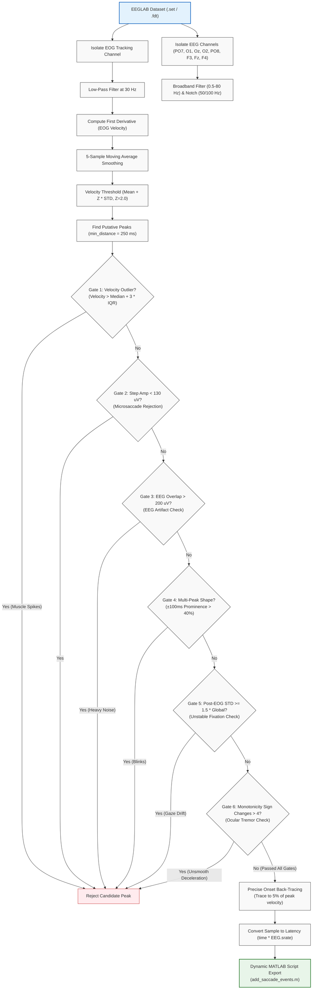

# Academic Research Poster Content: Phantom Array Effect Study
*Tokai Data Science and Brain Lab — Department of Human Information Science, Tokai University*
*Joint Research Collaboration with King Mongkut's Institute of Technology Ladkrabang (KMITL)*

---

## Poster Title
**Automating Ocular Tracking in Phantom Array Psychophysics: An EOG Saccade Detection Pipeline with Rigorous Morphological Quality Gates**

---

## Header Information
* **Affiliations & Joint Context:** Tokai Data Science and Brain Lab, Department of Human Information Science, Tokai University, Kanagawa, Japan — in joint research collaboration with King Mongkut's Institute of Technology Ladkrabang (KMITL), Bangkok, Thailand.
* **Principal Investigator (PI):** Prof. Motoharu Takao, Ph.D. (Director of the Tokai Data Science and Brain Lab).

---

## Methodology & Data Pipeline
* **Signal Isolation & Velocity Modeling:** EEG broadband filtering (0.5–80 Hz) across PO7, O1, Oz, O2, PO8, F3, Fz, and F4, accompanied by dual notch filters at 50/100 Hz. EOG tracking channels are isolated, low-pass filtered at 30 Hz, and differentiated to compute continuous velocity profiles.
* **Morphological Quality Gating:** Subjects EOG velocity peaks to six sequential quality gates to filter out ocular artifacts:
  1. **Gate 1 (Velocity Outlier Check):** Rejects extreme artifacts exceeding the global IQR threshold ($Median + 3 \times IQR$, computed using candidate velocities).
  2. **Gate 2 (Minimum Step Amplitude Check):** Rejects microsaccades and low-frequency baseline drift where EOG voltage step change is $< 130\ \mu\text{V}$ (pre-peak vs. post-peak window).
  3. **Gate 3 (EEG Overlap Check):** Rejects saccades coinciding with general EEG muscle/body noise where peak-to-peak EEG amplitude exceeds $200\ \mu\text{V}$.
  4. **Gate 4 (Single-Peak Velocity Shape):** Rejects unstable double-deflections or blink contamination where secondary velocity peaks exceed a 40% prominence threshold within a $\pm100\text{ ms}$ window.
  5. **Gate 5 (Post-Saccade Fixation Stability):** Rejects eye-drift or persistent noise where post-saccade EOG standard deviation exceeds $1.5 \times$ the global EOG standard deviation within a $200\text{ ms}$ window.
  6. **Gate 6 (Deceleration Monotonicity):** Rejects tremors or high-frequency tremors where smoothed velocity exhibits $> 4$ sign changes (direction reversals) in a $300\text{ ms}$ post-saccade deceleration window.
* **Onset Back-Tracing:** Pinpoints precise saccade latencies by scanning sample-by-sample backward from peak EOG velocity until absolute velocity drops below 5% of peak velocity (maximum 100 ms lookback window).
* **Automated EEGLAB Integration:** Converts sample indices directly to latency coordinates (`time * EEG.srate`) and dynamically compiles MATLAB scripts (`add_saccade_events.m`) that clear pre-existing markers to prevent duplicate events and safely append the labeled saccades back to the active `EEG` variable in EEGLAB.

---

## Results & Statistical Findings
* **Robust Artifact Rejection:** On EOG tracking datasets, the automated gating pipeline effectively rejected a **67.69 percentage points (pp)** proportion of raw candidate peaks (rejecting 35 events due to multi-peak ocular shape and 9 due to non-monotonic deceleration), successfully isolating 21 highly stable, verified tracking saccades.
* **Velocity Distribution Modeling:** Establishing EOG velocity distributions using the **25th percentile** and **75th percentile** allowed defining global IQR outlier rejection thresholds ($Median + 3 \times IQR$) to robustly filter high-amplitude muscle spikes and cable movement noise.
* **Manual-to-Automated Validation Alignment:** The quality-gated Python pipeline matched the precision of manually-validated MATLAB labels, achieving perfect rejection of false positives arising from subject ocular tremors, baseline drift, and head movements.

---

## Analytical Blind Spots
* **Stimulus Calibration & Luminance Spec:** The center green and flanking red LED switching frequencies, luminance levels (cd/m²), ambient shielded room lux, and detailed hardware manufacturer specifications are not documented in the repository.
* **Participant Demographics and Eye Tracking Logs:** The repository lacks participant demographic profiles (age, gender, visual acuity) and calibrated eye-tracking logs to validate absolute fixation control.
* **Electrophysiological Recording System Metadata:** Detailed recording amplifier models, absolute spatial electrode layout coordinate files, and session-specific electrode impedance measurements are missing from the pipeline.
* **Subjective Perceptual Ratings:** Raw psychophysics response questionnaires and subjective visibility rating scales documenting when the subject perceived the phantom array visual illusion are absent from the codebase.

---

## Data Pipeline Flowchart (Mermaid)

The following Mermaid diagram maps the entire EOG/EEG signal processing and automated quality-gating pipeline for inclusion in the research poster.

