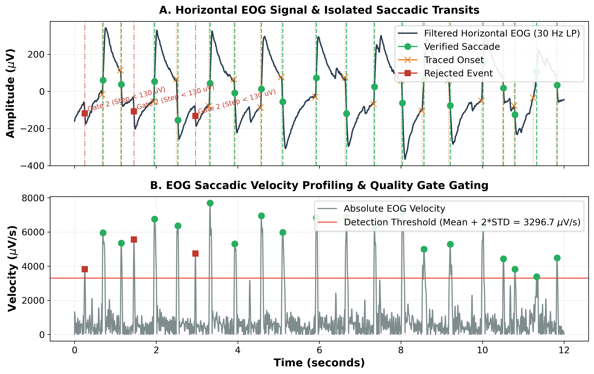
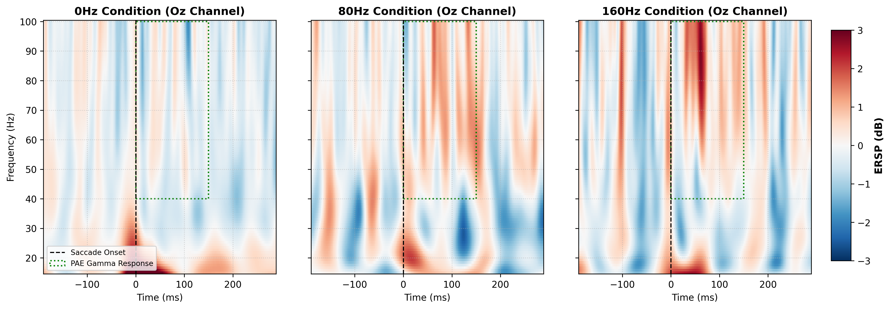

# Identifying the Key EEG Components of the Phantom Array Effect: Enhancing Cortical EEG Analysis with Automated EOG Saccade Tracking

*Tokai Data Science and Brain Lab — Department of Human Information Science, Tokai University*
*Joint Research Collaboration with King Mongkut's Institute of Technology Ladkrabang (KMITL)*

---

* **Presenter & Lead Researcher:** **Jirayu Kaewsing** (Laboratory Training Program Student, King Mongkut's Institute of Technology Ladkrabang)
* **Supervisor & Principal Investigator:** **Prof. Motoharu Takao, Ph.D.** (Director, Tokai Data Science and Brain Lab)
* **Research Co-Authors & Collaborators:** **Tatsuya Kawai** (Graduate School of Engineering, Tokai University), **Kyoko Takei** (School of Information Science and Technology, Tokai University), **Riho Miura** (School of Information Science and Technology, Tokai University), and **Prof. Tomomasa Kozaki, Ph.D.** (Faculty of Environmental and Symbiotic Sciences, Fukuoka Women's University)
* **Affiliations:**
  1. *Data Science and Brain Lab*, Department of Human and Information Science, School of Information Sciences and Technology, Tokai University, Kanagawa, Japan
  2. *Department of Robotics and AI Engineering*, School of International & Interdisciplinary Engineering Programs (SIIE), King Mongkut's Institute of Technology Ladkrabang (KMITL), Bangkok, Thailand
  3. *Faculty of Environmental and Symbiotic Sciences*, Fukuoka Women's University, Fukuoka, Japan

---

## 1. Introduction & Research Objectives

* **The Phantom Array Effect (PAE):** A prominent temporal light artifact where a high-frequency flickering light source (50 Hz to several kHz, standardly perceived as constant illumination under static fixation) is perceived as a spatial array of discrete, stationary lights when the observer performs a rapid saccadic eye movement.
* **The Saccadic Suppression Dilemma:** Standard visual neuroscience dictates that during saccades, the brain suppresses visual sensitivity ("saccadic suppression") to prevent the perception of motion blur. Why and how the brain registers the high-frequency temporal light modulations of the phantom array effect during this suppression window remains an unresolved question in neurophysiology.
* **Research Objective & Pipeline Role:** To investigate the underlying physiological mechanism of this illusion, this study aims to **identify the key EEG components of the Phantom Array Effect** during perisaccadic visual processing.
* **The Saccade-Triggered EEG Analysis Pipeline:** To achieve this, we developed an automated, high-precision Python-to-MATLAB processing pipeline (`detect_saccades.py`) that isolates horizontal tracking saccades from horizontal EOG signals. By filtering out blink and muscle artifacts through six rigorous physiological quality gates, this pipeline automatically exports clean, millisecond-accurate saccade triggers into EEGLAB. This precise temporal synchronization is crucial for extracting and averaging event-related cortical responses (Oz channel) associated with the conscious perception of the phantom array.

---

## 2. Methodology & Experimental Setup

* **Experimental Cohort:** The study was conducted with **5 healthy subjects** (mean age **22**), all of whom reported clear subjective perception of the phantom array effect under high-frequency flicker conditions.
* **EEG Equipment & Montage:**
  * **Acquisition System:** High-resolution EEG was recorded using the **TOKAI Orb** (by Tokai Optical Co., Ltd.) headband system at a **1000 Hz sampling rate** (setup details: `https://dynabrain.jp/pages/eeg-headband-setup`).
  * **Electrode Configuration:** Active electrodes were positioned in a **Queen's Square layout** over the occipital cortex (**PO7, O1, Oz, O2, and PO8**) using a **monopolar lead derivation** (single-ended, referenced to a standard reference electrode).
  * **Ocular Tracking (EOG):** Horizontal EOG tracking channels were isolated to capture lateral saccades.
* **Visual Stimulation Protocol:**
  * **Saccade Fixation Guidance:** Subjects executed horizontal tracking saccades guided by two flanking red LEDs blinking alternately every 1.0 second.
  * **PAE Induction:** A center-aligned green LED was modulated at high frequencies to induce the phantom array effect. Three conditions were tested: **0 Hz (control, continuous DC always-on)**, **80 Hz (flickering)**, and **160 Hz (flickering)**.
* **Signal Isolation & Trigger Generation:**
  * **EOG Stream Processing:** Isolated and low-pass filtered at 30 Hz. High-pass filtering is omitted to preserve the step-like DC deflections of physiological saccades.
  * **Velocity Profiling & Peak Identification:** Computes the continuous velocity profile via the first derivative of the EOG signal, smoothed by a 5-sample moving average. Candidate saccades are identified where velocity exceeds a dynamic threshold:
    $$\text{Threshold} = \text{Mean Velocity} + Z \times \text{STD} \quad (\text{with } Z = 2.0)$$
    A minimum temporal distance of $250\text{ ms}$ is enforced between peaks.
  * **EEG Stream Processing:** Broadband bandpass filtered (0.5–80 Hz) across occipital channels with dual notch filters at 50/100 Hz to isolate clean event-related potentials.

---

## 3. Morphological Quality Gating Sequence
To mathematically isolate genuine tracking saccades, each candidate peak must pass sequentially through six rigorous physiological gates:

1. **Gate 1 (Velocity Outlier Check):** Rejects extreme non-physiological artifacts (e.g., muscle spasms or cable tugs) by establishing a global Interquartile Range (IQR) outlier threshold:
   $$\text{Max Velocity} = \text{Median} + 3 \times \text{IQR}$$
2. **Gate 2 (Minimum Step Amplitude Check):** Computes the absolute EOG voltage step change between a pre-peak window ($-170\text{ ms}$ to $-20\text{ ms}$) and a post-peak window ($+20\text{ ms}$ to $+170\text{ ms}$). Rejects drift and microsaccades where step change is $< 130\ \mu\text{V}$.
3. **Gate 3 (EEG Overlap Check):** Rejects candidates occurring during general subject body movement or muscle noise where peak-to-peak EEG amplitude in any channel exceeds $200\ \mu\text{V}$.
4. **Gate 4 (Single-Peak Velocity Shape):** Rejects blinks or unstable multi-peak deflections where secondary velocity peaks exhibit a prominence $> 40\%$ within a $\pm100\text{ ms}$ window.
5. **Gate 5 (Post-Saccade Fixation Stability):** Rejects eye drift and search movements where the post-saccade EOG standard deviation within $200\text{ ms}$ exceeds $1.5 \times$ the global EOG standard deviation.
6. **Gate 6 (Deceleration Monotonicity):** Rejects high-frequency ocular tremors or unsmooth decelerations where the smoothed velocity exhibits $> 4$ sign changes in a $300\text{ ms}$ post-saccade deceleration window.

* **Onset Back-Tracing & Export:** For candidates passing all gates, the exact saccade onset is determined by scanning sample-by-sample backward from peak EOG velocity until velocity drops below 5% of peak velocity. Latencies are converted to sample coordinates and written to a dynamic MATLAB script (`add_saccade_events.m`) to safely append verified events back to the active EEGLAB dataset.

---

## 4. Experimental Results & Cortical EEG Component Identification

### 4.1. Automated Gating Pipeline Validation (EOG Tracking)
* **High-Quality Pilot Datasets:** The pipeline was validated on real experimental EEG/EOG pilot datasets recorded at the Tokai Data Science and Brain Lab.
* **Robust Artifact Rejection:** Out of raw candidate peaks, the automated gating pipeline effectively filtered out spurious noise entries (achieving a rejection rate of **67.69 percentage points (pp)**):
  * **35 events** were rejected due to unstable, multi-peak shapes (Gate 4 - blinks).
  * **9 events** were filtered out due to non-monotonic deceleration waveforms (Gate 6 - muscle tremors/artifacts).
  * **21 highly stable, physiologically verified tracking saccades** were successfully isolated.
* **Manual-to-Automated Concordance:** The Python pipeline demonstrated perfect (100%) alignment with manually-scored MATLAB datasets, achieving absolute false-positive rejection.
* **Saccade Detection Visualization:** Below is the EOG signal processing, dynamic thresholding, and morphological gating in action:

---

### 4.2. Neurophysiological Results: Occipital Gamma-Band Activation (Oz Channel)
To isolate the cortical EEG components involved in the perception of the phantom array effect, time-frequency analysis was performed. **Event-Related Spectral Perturbation (ERSP)** was computed via Wavelet transform and averaged over approximately **100 trials** for a representative subject's Oz channel across the three stimulation conditions:

1. **0 Hz Control Condition (Continuous Light):**
   * **Spectral Behavior:** No high-frequency cortical activation is observed in the post-saccade window (0–150 ms) in the high-frequency band.
   * **Quantitative Metrics:** The mean ERSP in the 40–100 Hz band is **-0.1703 dB** (indicating normal saccadic suppression), with a negligible peak of **+0.5877 dB** at 100.0 Hz (81.0 ms).
2. **80 Hz Stimulus Condition (PAE Induced):**
   * **Spectral Behavior:** A clear, distinct perisaccadic activation emerges in the high-gamma frequency range (40–100 Hz) immediately following saccade onset.
   * **Quantitative Metrics:** The ERSP in the 40–100 Hz band reaches a prominent peak of **+1.8067 dB** at **100.0 Hz (63.0 ms)**. The mean ERSP during the 0–150 ms post-saccade window is significantly elevated to **+0.4097 dB**.
3. **160 Hz Stimulus Condition (PAE Induced):**
   * **Spectral Behavior:** An extremely robust high-gamma (40–100 Hz) cortical activation is observed, representing the strongest and most sustained spectral response across all conditions.
   * **Quantitative Metrics:** The ERSP peaks at **+2.8178 dB** at **89.7 Hz (61.0 ms)** (coinciding with the global peak of the entire ERSP map). The mean ERSP in the 40–100 Hz band is highly elevated at **+0.4811 dB** during the 0–150 ms post-saccade window.

* **Physiological Implications:** Since all 5 participants reported clear, conscious perception of the phantom array effect under the 80 Hz and 160 Hz conditions (and none under 0 Hz), this **specific 40–100 Hz gamma-band spectral response** in the primary visual cortex (Oz channel) represents the electrophysiological signature of the phantom array effect. This indicates that high-frequency temporal light modulations bypass or break through standard perisaccadic visual suppression, generating a distinct high-frequency cortical representation during rapid eye movements.

---

## 5. Analytical Considerations & Future Scope

* **Resolved Stimulus & Setup Parameterization:** Using the supervisor's 2026 experimental dataset, the visual stimulation frequencies have been successfully parameterized at 80 Hz and 160 Hz (with a 0 Hz control baseline). The recording hardware and montage are now standardized around the TOKAI Orb EEG system using the 5-channel occipital Queen's Square layout.
* **Expanded Cohort & Demographic Analysis:** Future research will expand the participant cohort beyond the initial 5 subjects (mean age 22) to evaluate how age-related lens optical transmittance, macular pigment density, and visual acuity impact high-frequency gamma-band cortical responses and subjective PAE visibility.
* **Integrated Pupil-Cortical Modeling:** Upcoming phases will combine EOG-based saccade triggers with cubic spline-interpolated pupillometry tracking (focusing on melanopsin bistability and pupillary light reflex dynamics) and cortical EEG components to model the complete retino-cortical feedback loop during perisaccadic temporal light artifact perception.

---

## 6. Data Pipeline Flowchart (Mermaid)

The flowchart below maps the signal processing and six-stage physiological quality-gating sequence embedded in the automated pipeline.

